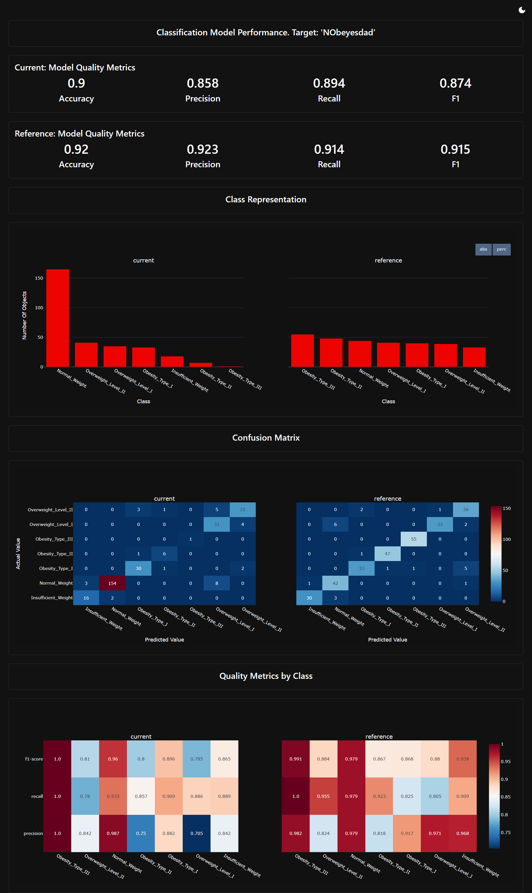
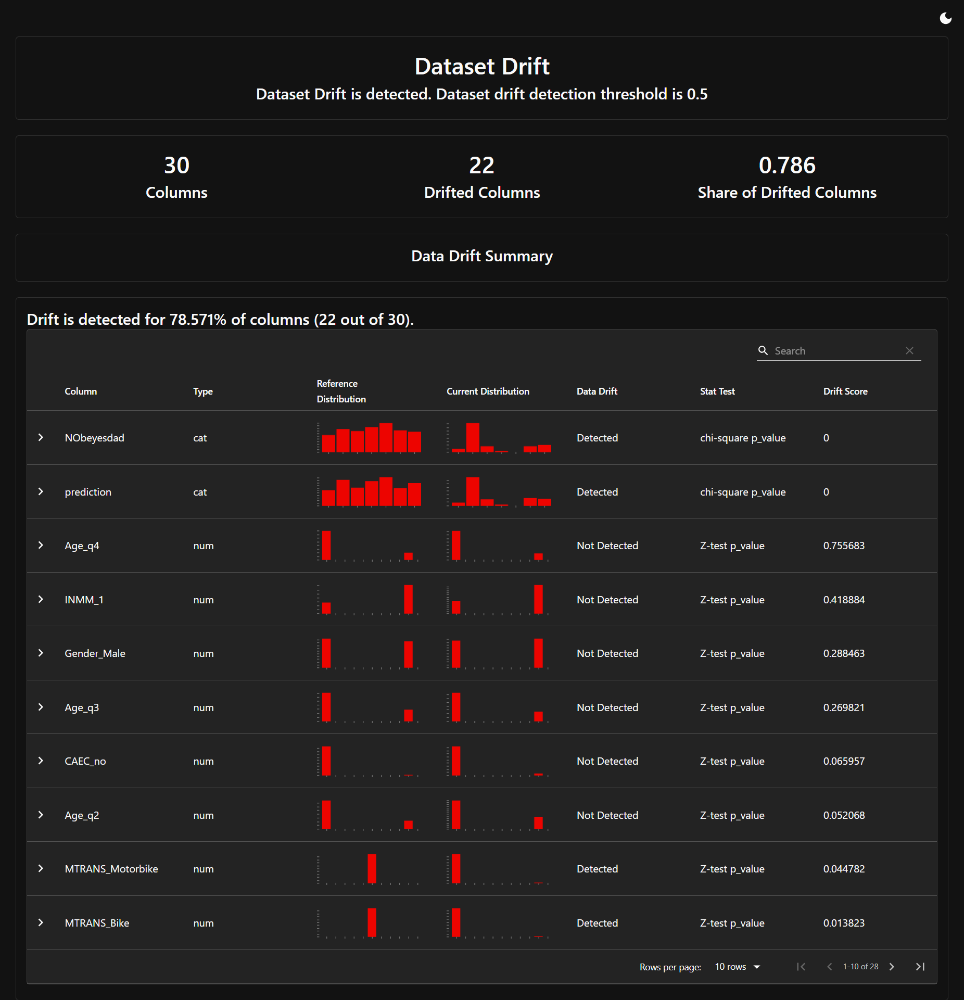
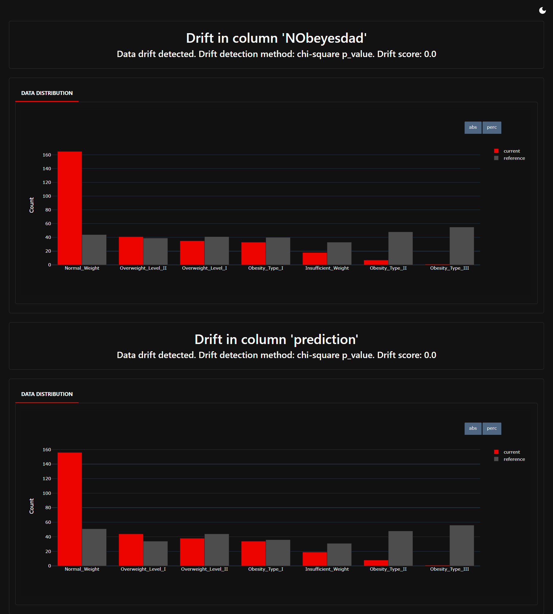
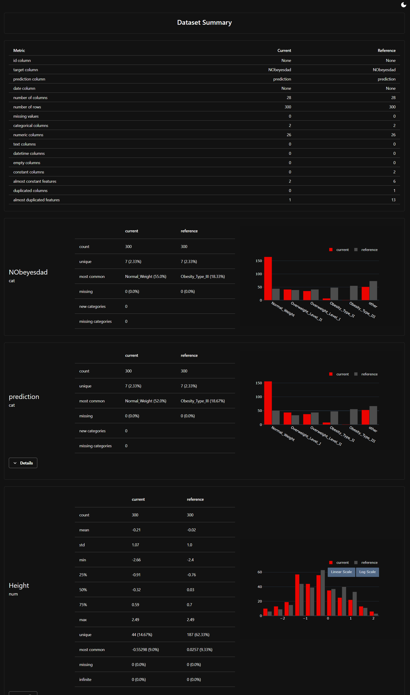

# End-to-End Machine Learning Project: Obesity Classification

[](https://github.com/mrpine65/e2e_ml/actions)

An end-to-end MLOps project for obesity level classification using personal health data. This project demonstrates a complete machine learning pipeline with automated training, deployment, and monitoring capabilities.

## 📋 Table of Contents

- [Overview](#overview)
- [Features](#features)
- [Project Structure](#project-structure)
- [Prerequisites](#prerequisites)
- [Installation](#installation)
- [Configuration](#configuration)
- [Usage](#usage)
- [API Endpoints](#api-endpoints)
- [Monitoring](#monitoring)
- [CI/CD Pipeline](#cicd-pipeline)
- [Docker Deployment](#docker-deployment)
- [Testing](#testing)
- [Contributing](#contributing)

## 🎯 Overview

This project implements a complete MLOps pipeline for predicting obesity levels based on personal health metrics including age, height, weight, and lifestyle factors. The system uses multiple machine learning algorithms with hyperparameter optimization and includes comprehensive monitoring for model performance and data drift.

### Problem Statement

Multi-class classification of obesity levels using personal health and lifestyle data.

### Models Supported

- LightGBM
- XGBoost
- CatBoost
- Random Forest
- Decision Tree

## ✨ Build With

- **API Framework:** FastAPI, Pydantic  
- **Cloud Server:** AWS EC2  
- **Containerization:** Docker, Docker Compose  
- **Continuous Integration (CI) & Continuous Delivery (CD):** GitHub Actions  
- **Data Version Control:** AWS S3  
- **Experiment Tracking:** MLflow, AWS RDS  
- **Exploratory Data Analysis (EDA):** Matplotlib, Seaborn  
- **Feature & Artifact Store:** AWS S3  
- **Feature Preprocessing:** Pandas, Numpy  
- **Feature Selection:** Optuna  
- **Hyperparameter Tuning:** Optuna  
- **Logging:** Loguru  
- **Model Registry:** MLflow  
- **Monitoring:** Evidently AI  
- **Programming Language:** Python 3  
- **Project Template:** Cookiecutter  
- **Testing:** PyTest  
- **Virtual Environment:** uv


## 📁 Project Structure

```
e2e_ml/
├── .github/
│   └── workflows/          # CI/CD pipeline definitions
│       ├── CI.yml          # Continuous Integration
│       ├── CT.yml          # Continuous Training
│       └── CD.yml          # Continuous Deployment
├── data/                   # Dataset storage (local/S3)
│   ├── download.sh         # Data download script
│   └── README.md           # Data documentation
├── models/                 # Trained models and artifacts
│   ├── artifacts/          # Model files
│   └── features/           # Feature metadata
├── notebooks/              # Research and experimentation
│   ├── eda.ipynb           # Exploratory Data Analysis
│   ├── data_processing.ipynb
│   ├── experimentations.ipynb
│   └── docs/               # Setup documentation
├── reports/                # Monitoring reports
│   ├── model_performance.html
│   ├── data_drift.html
│   ├── target_drift.html
│   └── data_quality.html
├── src/
│   ├── api/                # FastAPI application
│   │   ├── main.py         # API endpoints
│   │   └── utils.py        # Monitoring utilities
│   ├── config/             # Configuration files
│   ├── data/               # Data processing modules
│   ├── model/              # Model training and inference
│   ├── schema/             # Pydantic schemas
│   └── train_script.py     # Training pipeline
├── tests/                  # Unit and integration tests
│   ├── units/
│   └── integration/
├── docker-compose.yaml     # Docker services configuration
├── Dockerfile              # Production container
├── pyproject.toml          # Project dependencies (uv)
├── uv.lock                 # Locked dependencies
└── README.md               # This file
```

## 🔧 Prerequisites

- Python 3.10 or higher
- [uv](https://github.com/astral-sh/uv) package manager
- Docker and Docker Compose (for containerized deployment)
- AWS Account (optional, for cloud features)
- Kaggle API credentials (for dataset download)

## 📦 Installation

### 1. Clone the Repository

```bash
git clone https://github.com/yourusername/e2e_ml.git
cd e2e_ml
```

### 2. Install uv Package Manager

```bash
pip install uv
```

### 3. Install Dependencies

```bash
# Install all dependencies using uv
uv sync

# This will:
# - Create a virtual environment in .venv/
# - Install all dependencies from pyproject.toml
# - Use the locked versions from uv.lock
```

### 4. Activate Virtual Environment

```bash
# On Linux/macOS
source .venv/bin/activate

# On Windows
.venv\Scripts\activate
```

## ⚙️ Configuration

### 1. Set Up Credentials

Create a `credentials.yaml` file in `src/config/`:

```yaml
KAGGLE_USERNAME: your_kaggle_username
KAGGLE_KEY: your_kaggle_api_key
AWS_ACCESS_KEY: your_aws_access_key
AWS_SECRET_KEY: your_aws_secret_key
POSTGRESQL: postgresql://<DB_USER>:<DB_PASSWORD>@<DB_ENDPOINT>:5432/<DB_NAME>
S3: your-bucket-name
EC2_URL: your-ec2-instance-url
```

> **Note**: See `notebooks/docs/SETUP_AWS.md` for detailed AWS setup instructions.
> **Note**: See `notebooks/docs/SETUP_KAGGLE.md` for detailed KAGGLE setup instructions.

### 2. Download Dataset

```bash
cd data

# Download raw training data
bash download.sh 'raw'

# Download current/testing data
bash download.sh 'current'
```

## 🚀 Usage

### Training a Model

```bash
# Run the training pipeline
python -m src.train_script

# This will:
# - Load and preprocess data
# - Train multiple models with hyperparameter optimization
# - Log experiments to MLflow
```

### Running the API Server

```bash
# Start the FastAPI server
uvicorn src.api.main:app --host 0.0.0.0 --port 8000

# Access the API documentation
# Open http://localhost:8000/docs in your browser
```

### Making Predictions

```bash
# Using curl
curl -X POST "http://localhost:8000/predict" \
  -H "Content-Type: application/json" \
  -d '{
    "Age": 25,
    "Height": 1.75,
    "Weight": 70,
    "FCVC": 2.5,
    "NCP": 3,
    "CH2O": 2,
    "FAF": 2,
    "TUE": 1,
    "Gender": "Male",
    "family_history_with_overweight": "yes",
    "FAVC": "yes",
    "CAEC": "Sometimes",
    "SMOKE": "no",
    "SCC": "no",
    "CALC": "Sometimes",
    "MTRANS": "Public_Transportation"
  }'
```

## 🔌 API Endpoints

### Prediction

- **POST** `/predict` - Make obesity level predictions
  - Input: Person data (JSON)
  - Output: Predicted obesity level

### Monitoring

- **GET** `/monitor-model?windown_size=100` - Model performance report
- **GET** `/monitor-target?windown_size=100` - Target drift report
- **GET** `/monitor-data?windown_size=100` - Data drift report
- **GET** `/monitor-data-quality?windown_size=100` - Data quality report

All monitoring endpoints return HTML reports with visualizations.

## 📊 Monitoring

The project uses [Evidently](https://www.evidentlyai.com/) for comprehensive monitoring:

### Model Performance
<div align="center">
  
  <figcaption style="font-style:italic; color:gray;">Demo report: Model Performance Visualization</figcaption>
</div>


### Data Drift
<div align="center">
  
  <figcaption style="font-style:italic; color:gray;">Demo report: Data Drift Visualization</figcaption>
</div>

### Target Drift
<div align="center">
  
  <figcaption style="font-style:italic; color:gray;">Demo report: Target Drift Visualization</figcaption>
</div>

### Data Quality
<div align="center">
  
  <figcaption style="font-style:italic; color:gray;">Demo report: Data Quality Visualization</figcaption>
</div>

Access reports at `http://localhost:8000/monitor-*` endpoints or view saved HTML files in the `reports/` directory.

## 🔄 CI/CD Pipeline

The project includes three automated workflows:

### Continuous Integration (CI.yml)

- Triggered on: Push to main, Pull requests
- Steps:
  1. Install dependencies with `uv sync`
  2. Run unit and integration tests
  3. Generate coverage reports
  4. Build and push Docker image

### Continuous Training (CT.yml)

- Triggered on: Schedule (weekly) or manual dispatch
- Steps:
  1. Download latest data
  2. Train models with hyperparameter optimization
  3. Log experiments to MLflow

### Continuous Deployment (CD.yml)

- Triggered on: Manual dispatch
- Steps:
  1. Deploy to EC2 instance
  2. Update running containers

## 🐳 Docker Deployment

### Using Docker Compose

```bash
# Start all services
docker compose up -d

# View logs
docker compose logs -f

# Stop services
docker compose down
```

### Manual Docker Build

```bash
# Build the image
docker build -t e2e-ml:latest .

# Run the container
docker run -p 8000:8000 \
  -v $(pwd)/models:/e2e_ml/models \
  -v $(pwd)/data:/e2e_ml/data \
  -v $(pwd)/reports:/e2e_ml/reports \
  e2e-ml:latest
```

## 🧪 Testing

```bash
# Run all tests
pytest

# Run with coverage
pytest --cov-report html:reports/cov_html --cov=. tests/ --disable-warnings

# Run specific test file
pytest tests/units/test_data_processing.py

# Run integration tests only
pytest tests/integration/
```

## 📚 Additional Documentation

- [AWS Setup Guide](notebooks/docs/SETUP_AWS.md) - Detailed AWS configuration
- [Data Documentation](data/README.md) - Dataset information
- [Notebooks Guide](notebooks/README.md) - Research environment setup

## 🛠️ Development

### Adding New Dependencies

```bash
# Add a new package
uv add package-name

# Add a development dependency
uv add --dev package-name

# Update all dependencies
uv sync --upgrade
```

## 🤝 Contributing

1. Fork the repository
2. Create a feature branch (`git checkout -b feature/amazing-feature`)
3. Commit your changes (`git commit -m 'Add amazing feature'`)
4. Push to the branch (`git push origin feature/amazing-feature`)
5. Open a Pull Request

## 📧 Contact

For questions or support, please open an issue on GitHub.

---

**Built with ❤️ using FastAPI, MLflow, and uv**
