# Setting Up an AWS Account

## Create IAM User, IAM Group, and Access Key

### Step 1: Create an IAM Group

1. Sign in to the **AWS Management Console** at [https://console.aws.amazon.com/](https://console.aws.amazon.com/).
2. In the search bar at the top, type **IAM**.
3. Click **IAM** to open the **IAM Dashboard**.
4. In the left navigation pane, select **User groups**.
5. Click **Create group**.
6. Enter a group name (e.g., `Administrator`).
7. Under **Attach permissions policies**, search for and select the following policies:

   * **AmazonEC2FullAccess**
   * **AmazonS3FullAccess**
   * **AmazonRDSFullAccess**
8. Click **Create group**.

Validating above using the AWS user interface:
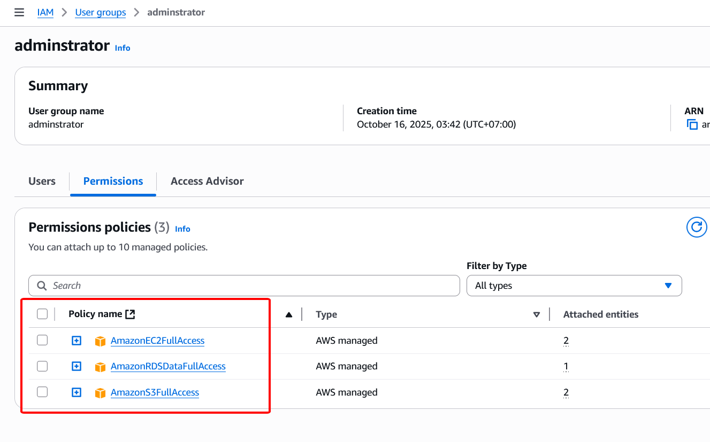

### Step 2: Create an IAM User

1. In the IAM console, select **Users** from the left navigation pane.
2. Click **Create user**.
3. Enter a username (e.g., `e2e-user`).
4. Click **Next**.
5. On the **Set permissions** page, select **Add user to group**.
6. Choose the group you created in **Step 1** (e.g., `Administrator`).
7. Click **Next**.
8. Review the details and click **Create user**.

Validating above using the AWS user interface:
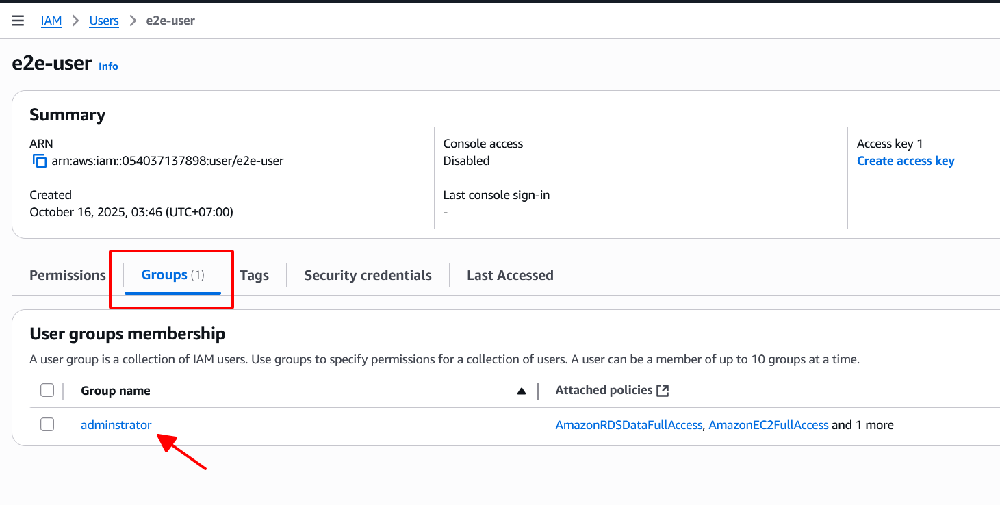

✅ Here’s a **polished and professionally formatted** version of your **“Create an Access Key”** section — with improved clarity, consistent style, and suitable for formal technical documentation:

---

### Step 3: Create an Access Key

This step creates an **Access Key ID** and **Secret Access Key** for the IAM user, which will be used to authenticate AWS CLI and SDK operations.

1. In the **IAM Console**, navigate to **Users**, then select the IAM user you created previously.
2. Open the **Security credentials** tab.
3. In the **Access keys** section, click **Create access key**.
4. Select **Command Line Interface (CLI)** as the use case. <br>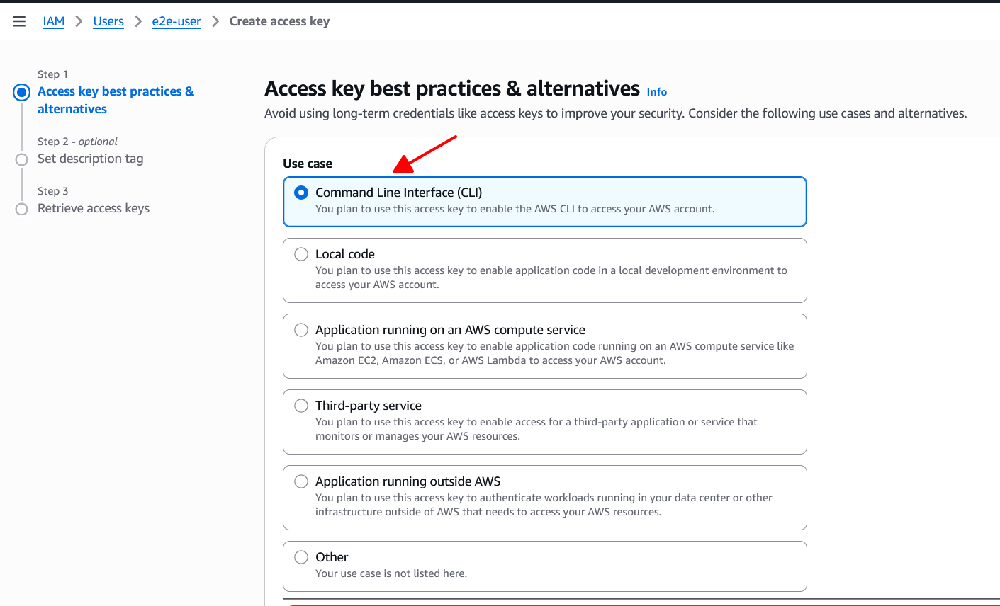
5. At the bottom of the page, tick the checkbox:

   > “I understand the above recommendation and want to proceed to create an access key.”
6. Click **Next**.
7. Click **Create access key**.
8. ⚠️ **Important:** Securely record the **Access Key ID** and **Secret Access Key** immediately.

   * The **Secret Access Key** will only be displayed once and cannot be retrieved later.
9. Click **Download .csv file** to save the access key information in a secure location. <br>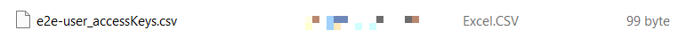
10. Click **Done** to complete the process.

---

## Create an S3 Bucket

### Step 1: Access the S3 Service

1. Sign in to the **AWS Management Console** at [https://console.aws.amazon.com/](https://console.aws.amazon.com/).
2. In the search bar at the top, type **S3**.
3. Click **S3** to open the **S3 Dashboard**.

### Step 2: Create a New Bucket

1. Click **Create bucket**.
2. Enter a **Bucket name** (e.g., `e2e-bucket`).
3. Scroll to the bottom of the page and click **Create bucket**.

---

## Create a PostgreSQL RDS Instance

### Step 1: Access the RDS Service

1. Sign in to the **AWS Management Console** at [https://console.aws.amazon.com/](https://console.aws.amazon.com/).
2. In the search bar at the top, type **Aurora and RDS**.
3. Click **Aurora and RDS** to open the **RDS Dashboard**.
4. Click **Create database**.
5. Select **Standard create**.
6. Under **Engine type**, choose **PostgreSQL**.<br>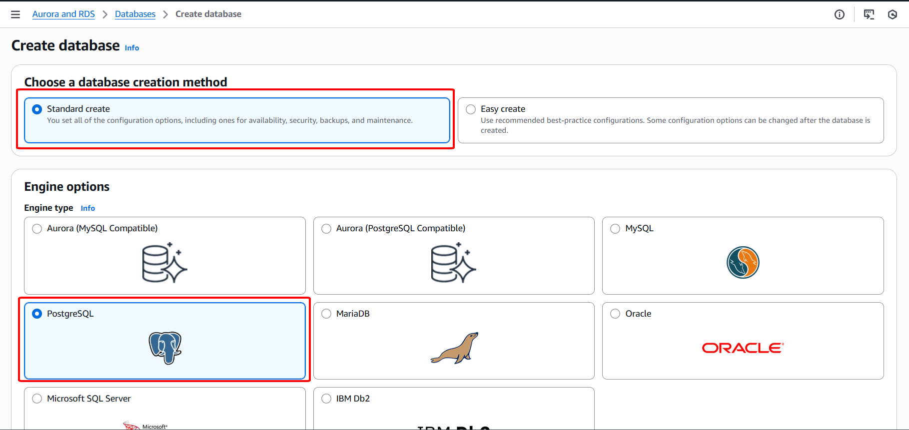
7. Under **Templates**, choose **Sandbox** (ideal for development or testing environments).<br>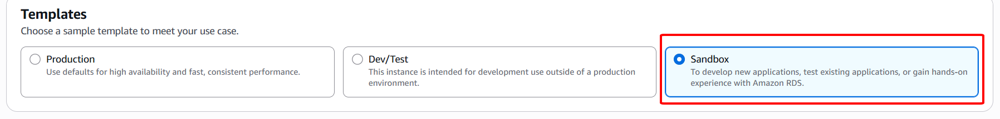

### Step 2: Configure Basic Settings

1. **DB instance identifier:** Keep the default value or enter a meaningful name for your instance.
2. **Master username:** Leave as `postgres` (default).
3. **Credentials management:** Select **Self managed**.

   * Uncheck **Auto generate a password**.
   * Enter a secure password in the **Master password** field.
   * Re-enter the same password in **Confirm password**.

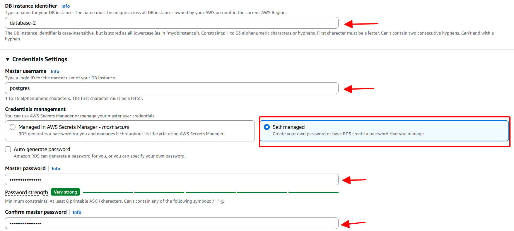

### Step 3: Configure Instance and Network Settings

1. **Connectivity:** Select **Don’t connect to an EC2 compute resource** to configure manually.
2. **Virtual Private Cloud (VPC):** Choose the **Default VPC**.
3. **DB Subnet group:** Select **Default**.
4. **Public access:** Choose **No** to restrict database access to within the VPC for better security.<br>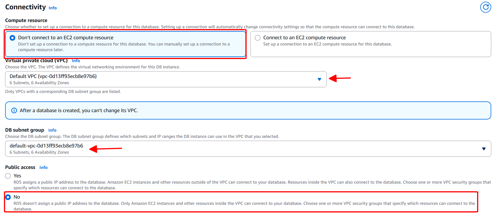
5. **VPC security groups:**

   * Select **Create new**.
   * Enter a name for the new security group (e.g., `e2e-postgres-sg`).<br>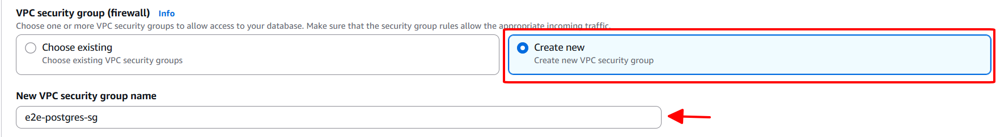

### Step 4: Additional Configuration

1. Under **Initial database name**, enter the name of your database (e.g., `e2e_db`).<br>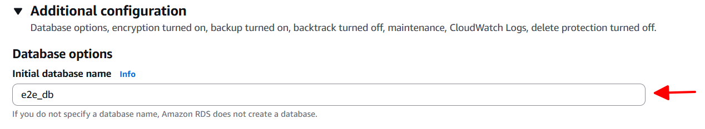
2. Scroll down and click **Create database**.

---

## Create an EC2 Instance

### Step 1: Sign In and Access the EC2 Service

1. Sign in to the **AWS Management Console** at [https://console.aws.amazon.com/](https://console.aws.amazon.com/).
2. In the search bar at the top, type **EC2**.
3. Click **EC2** to open the **EC2 Dashboard**.

### Step 2: Start Instance Creation

1. From the **EC2 Dashboard**, click **Launch Instance**.
2. Enter a name for your instance (e.g., `e2e-ec2`).

### Step 3: Choose an Application and OS Image (AMI)

1. Select **Ubuntu** as the operating system.
2. Choose **Ubuntu Server 22.04 LTS** under the **Amazon Machine Image (AMI)** section.<br>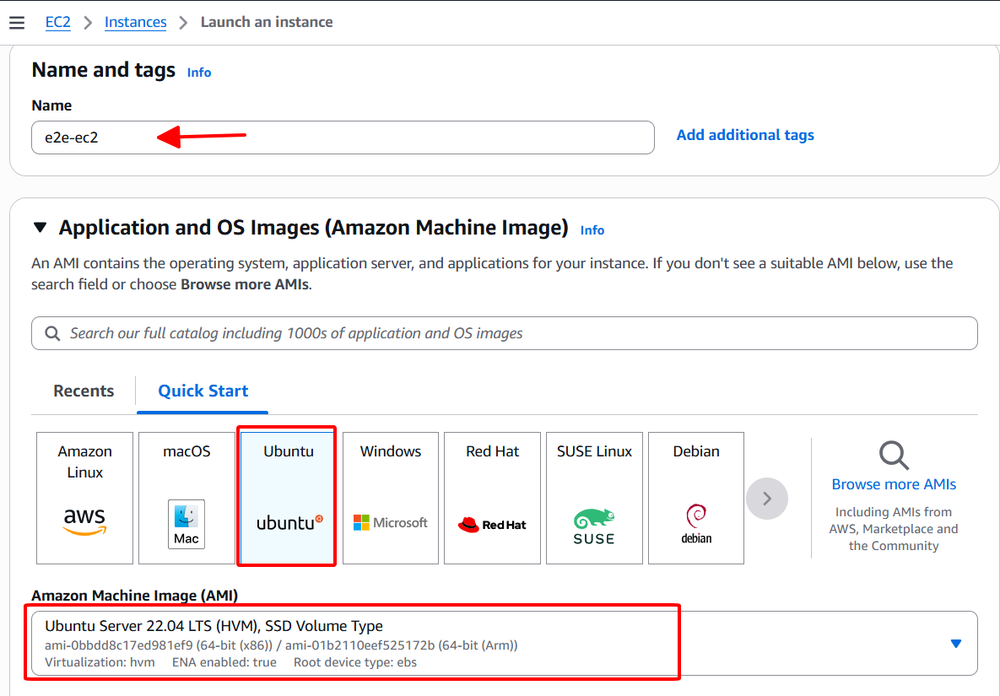

### Step 4: Select Instance Type

1. Choose **t3.micro** as the instance type. *(This is eligible for the AWS Free Tier.)*<br>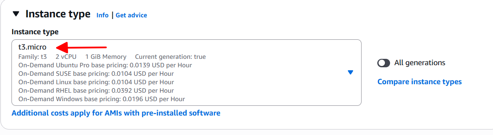

### Step 5: Create a Key Pair (Login)

1. Click **Create new key pair**.
2. Enter a name (e.g., `e2e`).
3. Select **RSA** as the key type.
4. Choose the **.pem** format.
5. Click **Create key pair**.<br>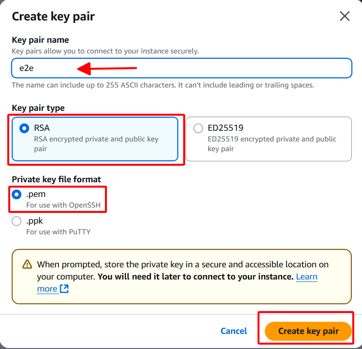
6. A `.pem` file will be downloaded to your machine — **store this file securely**. You’ll need it later to connect via SSH.

### Step 6: Configure Network Settings

1. In the **Network settings** section, click **Edit** (top right).
2. Under **Firewall (security groups)**, select **Create security group**.
3. Change the **Security group name** to something descriptive (e.g., `e2e-ec2-sg`).<br>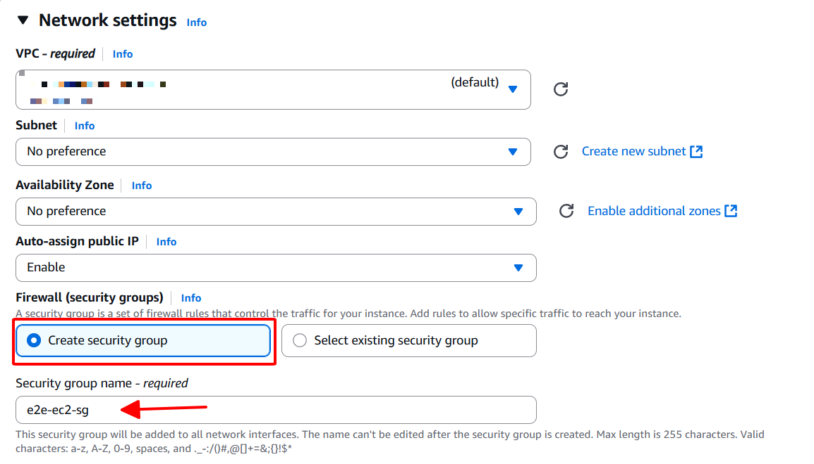

### Step 7: Configure Storage

1. Set the storage volume to **20 GiB gp3** (default type).<br>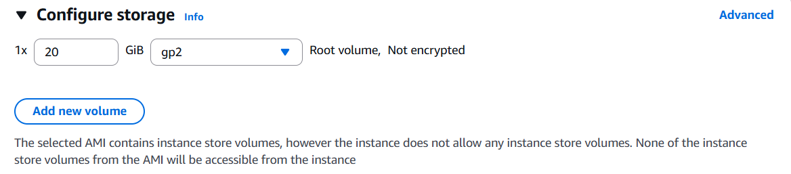

### Step 8: Launch the Instance

1. Scroll to the bottom and click **Launch instance**.
2. Wait for the confirmation message **“Successfully initiated launch of instance.”**
3. Click **View all instances** to see your running EC2 instance.

---

## Security Group Configuration: EC2 to RDS & Internet Access

This section describes how to configure AWS Security Groups to:

* Allow **external internet traffic** to reach the EC2 instance on a specific port.
* Enable **secure communication** between the EC2 instance and the PostgreSQL RDS instance.
* EC2 Console → Network & Security → Security Groups

### Step 1: Configure Inbound Rules for the EC2 Security Group

1. Open the **EC2 Console**.
2. In the left navigation pane, go to **Network & Security → Security Groups**.
3. Select the **EC2 Security Group** (e.g., `e2e-ec2-sg`).<br>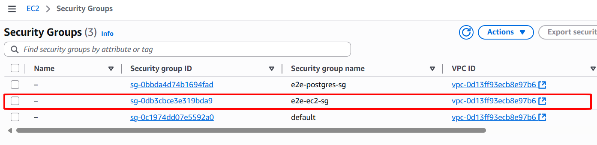
4. Open the **Inbound rules** tab.
5. Click **Edit inbound rules**.<br>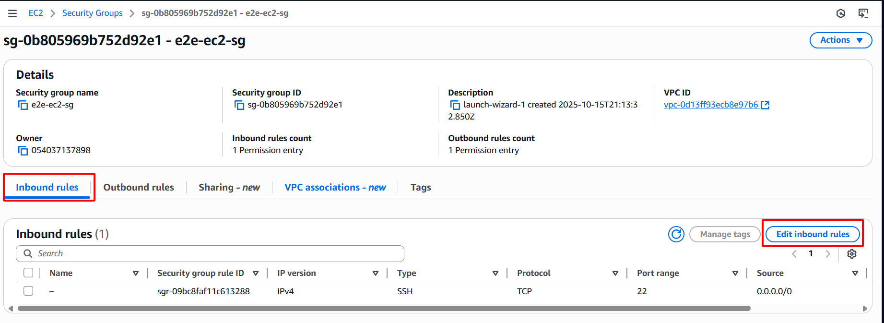
6. Click **Add rule**.
7. Configure the rule to allow inbound traffic on port `5000` (for example, to expose a web service):

   * **Type:** Custom TCP
   * **Protocol:** TCP
   * **Port range:** 5000
   * **Source:** 0.0.0.0/0
8. Click **Save rules**.<br>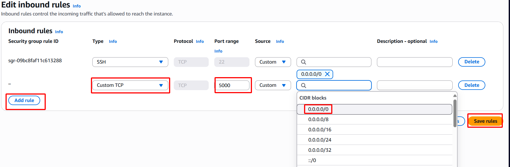

> ⚠️ **Note:** Opening port `5000` to `0.0.0.0/0` makes your service accessible from the internet. For production environments, consider restricting access to trusted IP addresses only.

### Step 2: Configure Outbound Rules for the EC2 Security Group

1. Open the **Outbound rules** tab of the **same EC2 Security Group**.
2. Click **Edit outbound rules**.<br>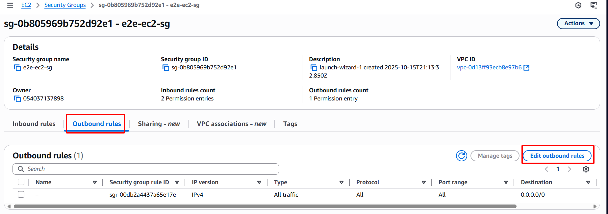
3. Click **Add rule**.
4. Add a rule to allow outbound traffic to the PostgreSQL RDS instance:

   * **Type:** PostgreSQL
   * **Protocol:** TCP
   * **Port range:** 5432
   * **Destination:** Select the **RDS Security Group** (e.g., `e2e-postgres-sg` | `sg-09r493hfiufh784434`).
5. Click **Save rules**.<br>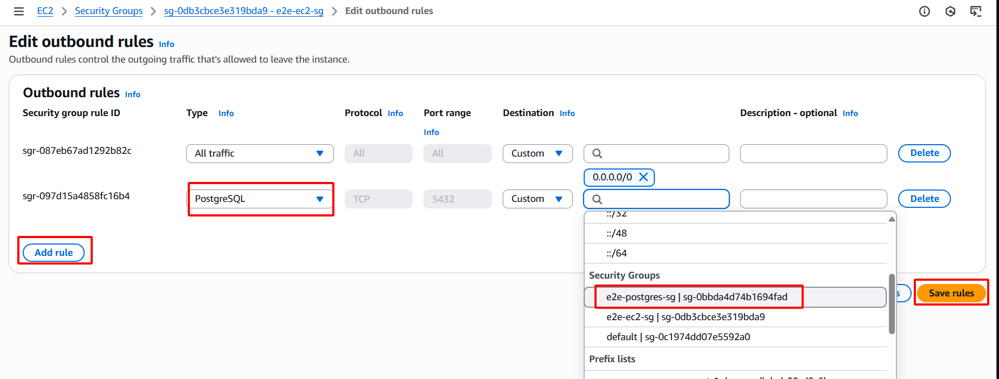

### Step 3: Configure Inbound Rules for the RDS Security Group

1. Go back to the **Security Groups** list and select the **RDS PostgreSQL Security Group** (e.g., `e2e-postgres-sg`).<br>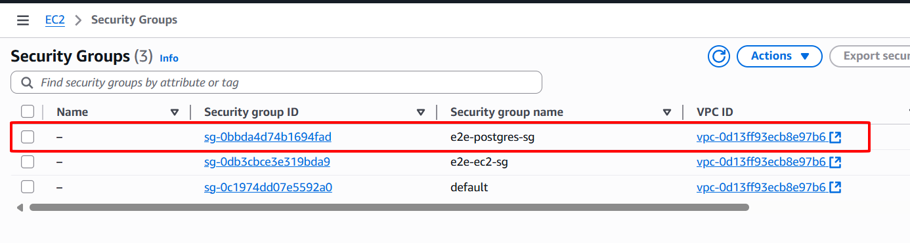
2. Open the **Inbound rules** tab.
3. Click **Edit inbound rules**.<br>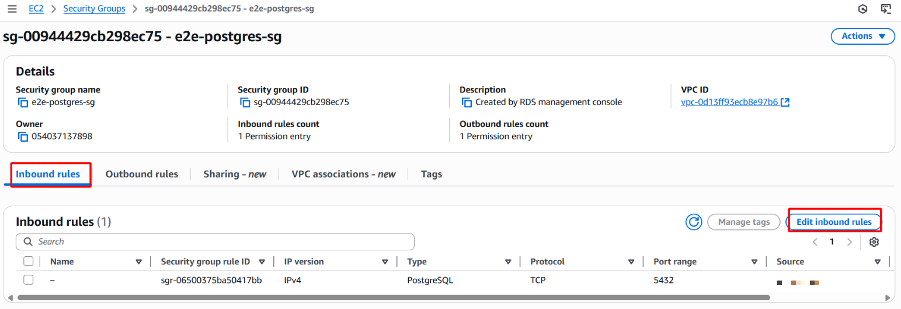
4. Click **Add rule**.
5. Configure the rule to allow inbound traffic from the EC2 instance:

   * **Type:** PostgreSQL
   * **Protocol:** TCP
   * **Port range:** 5432
   * **Source:** Select the **EC2 Security Group** (e.g., `e2e-ec2-sg` | `sg-fwiuefh782y84h23oe`).
6. Click **Save rules**.<br>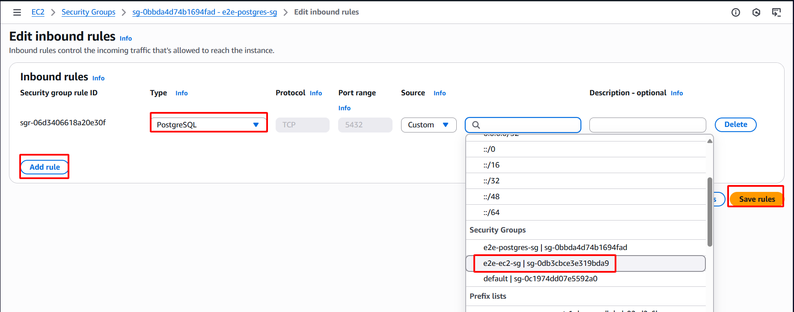

### ✅ Summary

* **EC2 Inbound:** Opened port 5000 to allow external access to your EC2 application.
* **EC2 Outbound:** Allowed traffic to PostgreSQL on port 5432 directed to the RDS security group.
* **RDS Inbound:** Allowed incoming traffic on port 5432 from the EC2 security group only — ensuring controlled database access.

---

## Connect to EC2 and Set Up the Server Environment

### Step 1. Accessing the EC2 Instance

1. Navigate to **EC2 → Instances → Instances** in the AWS Management Console.
2. Select the target EC2 instance (e.g., `e2e-ec2`).<br>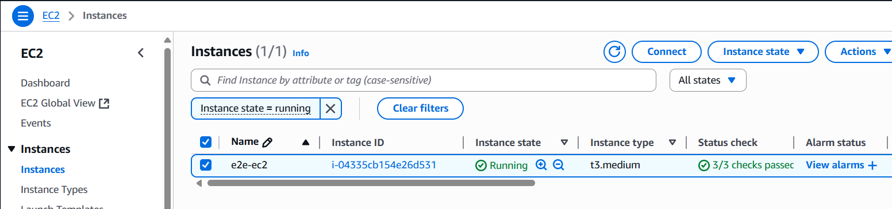
3. Click **Connect** (top-right corner).<br>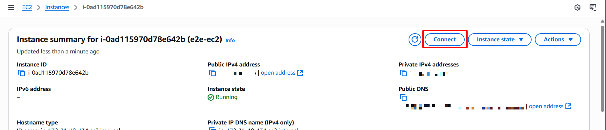
4. Choose the **EC2 Instance Connect** tab.
5. Click **Connect** (bottom-right) to open an in-browser SSH terminal session.<br>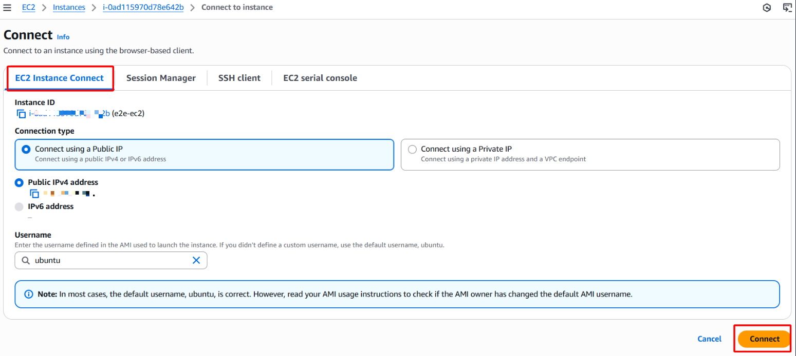

### Step 2. Installing AWS CLI

The AWS Command Line Interface (CLI) is required for interacting with AWS services programmatically.

```bash
sudo apt-get update -y
sudo apt install -y unzip curl
curl "https://awscli.amazonaws.com/awscli-exe-linux-x86_64-2.0.30.zip" -o "awscliv2.zip"
unzip awscliv2.zip -d ~
sudo ~/aws/install
rm awscliv2.zip
```

> ⚠️ **Note:** After installation, verify with `aws --version`.

### Step 3. Installing Docker and Configuring User Permissions

Docker is used for containerized deployments. The following commands install Docker Engine and configure the current user to run Docker without `sudo`:

```bash
sudo apt-get update -y
sudo apt-get install -y ca-certificates curl gnupg lsb-release

# Add Docker’s GPG key
sudo install -m 0755 -d /etc/apt/keyrings
sudo curl -fsSL https://download.docker.com/linux/ubuntu/gpg -o /etc/apt/keyrings/docker.asc
sudo chmod a+r /etc/apt/keyrings/docker.asc

# Add the Docker repository
echo \
  "deb [arch=$(dpkg --print-architecture) signed-by=/etc/apt/keyrings/docker.asc] https://download.docker.com/linux/ubuntu \
  $(. /etc/os-release && echo "${UBUNTU_CODENAME:-$VERSION_CODENAME}") stable" | \
  sudo tee /etc/apt/sources.list.d/docker.list > /dev/null

# Install Docker Engine
sudo apt-get update -y
sudo apt-get install -y docker-ce docker-ce-cli containerd.io docker-buildx-plugin docker-compose-plugin

# Add user to Docker group
sudo groupadd docker
sudo usermod -aG docker $USER
```

> ✅ Run `newgrp docker` or re-login to apply the group changes.
> Verify installation with `docker run hello-world`.

### Step 4. Installing Miniconda

Miniconda provides an isolated Python environment for dependency management:

```bash
mkdir -p ~/miniconda3
wget https://repo.anaconda.com/miniconda/Miniconda3-latest-Linux-x86_64.sh -O ~/miniconda3/miniconda.sh
bash ~/miniconda3/miniconda.sh -b -u -p ~/miniconda3
rm ~/miniconda3/miniconda.sh
source ~/miniconda3/bin/activate
conda init --all
```

> After installation, run `source ~/.bashrc` or reconnect to the instance to ensure conda commands are available globally.

### Step 5. Installing Python Requirements

The following libraries are essential for running MLflow with AWS integration:

```bash
pip install mlflow boto3 psycopg2-binary
```

* **mlflow** – Experiment tracking and model registry.
* **boto3** – AWS SDK for Python, required for S3 and RDS interactions.
* **psycopg2-binary** – PostgreSQL adapter for Python.

### Step 6. Configuring AWS CLI Credentials

Run the AWS CLI configuration command to provide credentials and default settings:

```bash
aws configure
```

You will be prompted to enter:

* **AWS Access Key ID**
* **AWS Secret Access Key**
* **Default region name** (e.g., `us-east-1`)
* **Default output format** (e.g., `json`)

> ⚠️ Ensure the IAM user associated with these credentials has appropriate permissions for S3 and RDS access.

### Step 7. Running MLflow Server on EC2

The following command launches an MLflow tracking server on the EC2 instance, listening on port **5000**, and configured to use **PostgreSQL (RDS)** as the backend store and **S3** as the artifact store:

```bash
nohup mlflow server -h 0.0.0.0 -p 5000 --backend-store-uri postgresql://<DB_USER>:<DB_PASSWORD>@<DB_ENDPOINT>:5432/<DB_NAME> --default-artifact-root s3://<S3_BUCKET_NAME> > e2e_ml.log 2>&1 &
```

* `nohup` ensures the process continues to run even after the SSH session is closed.
* `-h 0.0.0.0` binds the server to all network interfaces, allowing external access (make sure port **5000** is open in the EC2 security group).
* `-p 5000` specifies the server’s listening port.
* `--backend-store-uri` points to the PostgreSQL database hosted on Amazon RDS.
* `--default-artifact-root` specifies the S3 bucket to store MLflow artifacts.
* Standard output and error are redirected to `e2e_ml.log`, and the process runs in the background (`&`).

### ✅ Verification

Once the server is running, you can:

* Access the MLflow UI via
  `http://<EC2_PUBLIC_IP>:5000`
  (Ensure port 5000 is allowed in the EC2 Security Group inbound rules.)
* Check logs using:

  ```bash
  tail -f e2e_ml.log
  ```

* Confirm AWS credentials and connectivity with:

  ```bash
  aws s3 ls
  ```
