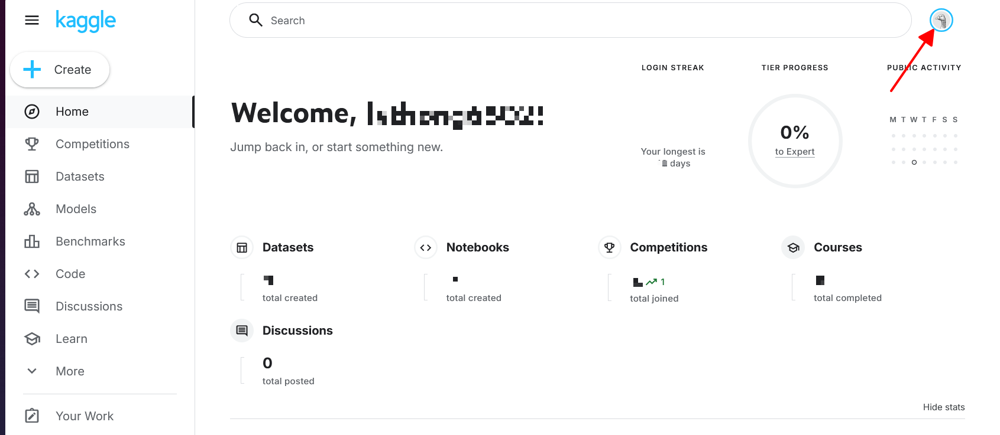
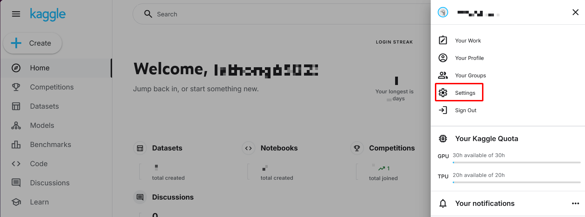
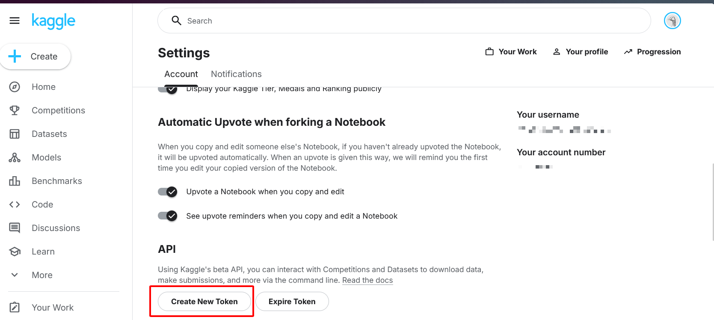

## Setting Up Your Kaggle Account

To use the **Kaggle API**, you first need to create a Kaggle account at [https://www.kaggle.com](https://www.kaggle.com). 

Next, navigate to the **Account** tab in your user profile:
[https://www.kaggle.com/ <username>/account](https://www.kaggle.com/<username>/account) 

Click **“Create API Token”**. This will download a file named `kaggle.json`, which contains your API credentials. 

Finally, place your **Kaggle API credentials** in the `credentials.yaml` file. These credentials will be used to authenticate and download datasets via the Kaggle API.
